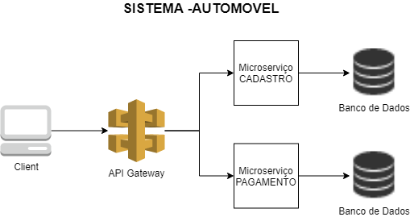

# Sistema-Automovel
Sistema composto por três microserviços: cadastro, geração de boleto para compra de automoveis e gateway.

O acesso aos serviços de Cadastro e Pagamento devem ser feitos atraves do api gateway.



## Ponto de Partida

### Iniciar a aplicação via IDE
1. Abrir o projeto **gateway** na IDE e executar a classe ApplicationMain
2. Abrir o projeto **cadastro** na IDE e executar a task: mvn clean install
3. Ainda no projeto cadastro, atraves do terminal, executar o comando: java -jar target\cadastro-0.0.1-SNAPSHOT.jar (a aplicação subirá na porta 8060)
5. Abrir o projeto **pagamento** na IDE e executar a task: mvn clean install
7. Ainda no projeto pagamento, atraves do terminal, executar o comando: java -jar target\pagamento-0.0.1-SNAPSHOT.jar (a aplicação subirá na porta 8050)

Para consumir os serviços descritos abaixo, basta acessa-los atraves da url: **localhost:8080**/  

## Microserviço Cadastro /cadastro

### [POST] "/cadastroAutomoveis"
Criar um registro de um novo Carro

  - Request body: 
  ```
    {
    "brand":"String",
    "model":"String",
    "price": 99999.99
    }
  ```
  - Response:
  
    Status Code 201 - Created
    
    Status Code 500 - Internal Sever Error
  
  - Exemplo no Postman cURL:
```
    curl --location --request POST 'localhost:8080/cadastro/cadastroAutomoveis' \
    --header 'Content-Type: application/json' \
    --data-raw '{"brand":"ford","model":"focus","price": 62200.00}'
```    
 ### [GET] "/automoveis"
Lista todos os registros de Carro armazenados

  -Response:
  
    Status Code 200 - OK
```    
    [
      {
        "id": 1,
        "brand": "String",
        "model": "String",
        "price": 88880.00,
        "registerDate": "yyyy-MM-dd"
      },
      {
        "id": 2,
        "brand": "String",
        "model": "String",
        "price": 99999.99,
        "registerDate": "yyyy-MM-dd"
     }
   ]
```   
   Status Code 500 - Internal Sever Error
  
  - Exemplo no Postman cURL:
```  
  curl --location --request GET 'localhost:8080/cadastro/automoveis'
``` 
## Microserviço Pagamento - /pagamento

### [POST] "/boleto"
Gera o numero de boleto e cria o registro desse boleto

  - Request body: 
```  
    {
       "marca":"String",
       "modelo":"String",
       "valor": 99999.99
    }
```  
  - Response:
  
    Status Code 201 - Created
```    
    {
      "codigoBoleto": "String",
      "dataVencimento": "yyyy-MM-dd",
      "valor": "String"
    }
```    
   Status Code 500 - Internal Sever Error
  
  - Exemplo no Postman cURL:
```  
    curl --location --request POST 'localhost:8080/pagamento/boleto' \
  --header 'Content-Type: application/json' \
  --data-raw '{"marca":"ford","modelo":"focus","valor": 62200.00}'
```
